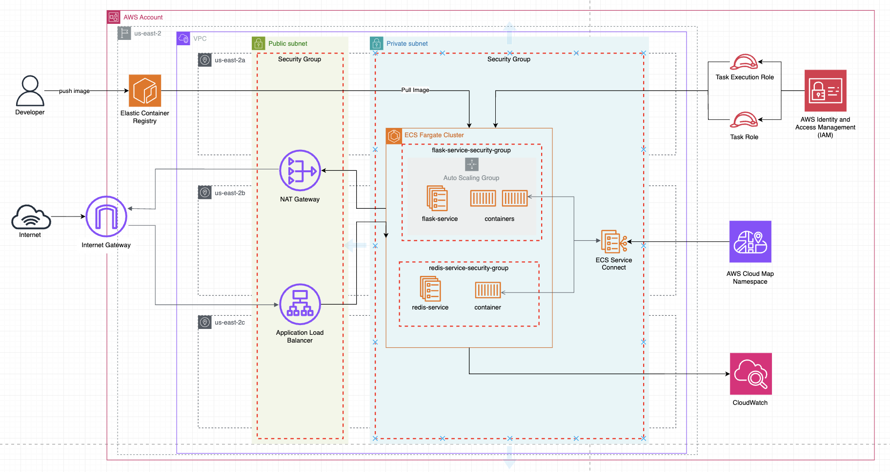

<!-- BEGIN_TF_DOCS -->

# Flask Redis ECS Stack

A containerized Flask web application with Redis backend deployed on AWS ECS with auto-scaling, load balancing, and comprehensive monitoring.

## 🏗️ Architecture

This project demonstrates a containerized application deployment using AWS ECS Fargate with the following comprehensive architecture that is built using Terraform:

### Diagram




### Development Workflow
- **Developer**: Builds and pushes Docker images to ECR
- **Elastic Container Registry (ECR)**: Stores versioned container images

### Network Architecture
- **VPC**: Multi-AZ deployment across `us-east-2a`, `us-east-2b`, and `us-east-2c`
- **Public Subnets**: Host the Application Load Balancer and NAT Gateway
- **Private Subnets**: Secure placement of ECS tasks and services
- **Internet Gateway**: Provides internet access to public resources
- **NAT Gateway**: Enables outbound internet access for private resources

### Application Components
- **Flask Service**: Python Flask web application running in ECS Fargate containers
  - Protected by dedicated security group (`flask-service-security-group`)
  - Multiple container instances for high availability
- **Redis Service**: Redis cache/session store running in ECS Fargate containers
  - Protected by dedicated security group (`redis-service-security-group`)
  - Service-to-service communication with Flask via ECS Service Connect
- **Application Load Balancer**: Distributes incoming traffic across Flask service instances
- **ECS Service Connect**: Enables secure service-to-service communication

### Security & Access Management
- **IAM Roles**: 
  - **Task Execution Role**: Allows ECS to pull images and write logs
  - **Task Role**: Runtime permissions for application containers
- **AWS Identity and Access Management (IAM)**: Central identity and permissions management
- **Security Groups**: Network-level access control for each service tier

### Monitoring & Observability
- **CloudWatch**: Comprehensive logging and monitoring
  - Container logs aggregation
  - Performance metrics and alarms
  - Auto-scaling triggers based on CPU utilization
- **AWS Cloud Map Namespace**: Service discovery for internal communication

### Infrastructure Features
- **Container Orchestration**: Amazon ECS with Fargate launch type
- **Auto Scaling**: Service auto-scaling based on CPU utilization
- **Infrastructure as Code**: Terraform for complete infrastructure management
- **Container Registry**: Amazon ECR for Docker image storage and lifecycle management

## 📋 Prerequisites

Before you begin, ensure you have the following installed:

- [Docker](https://docs.docker.com/get-docker/) (v20.10+)
- [AWS CLI](https://aws.amazon.com/cli/) (v2.0+)
- [Terraform](https://www.terraform.io/downloads.html) (v1.0+)
- [Git](https://git-scm.com/downloads)

### AWS Requirements
- AWS account with appropriate permissions for:
  - ECS (Elastic Container Service)
  - ECR (Elastic Container Registry) 
  - VPC and networking resources
  - IAM roles and policies
  - Application Load Balancer
  - CloudWatch logging and monitoring
- AWS CLI configured with credentials
- Sufficient IAM permissions for Terraform to create and manage AWS resources

## 🚀 Quick Start

### 1. Clone the Repository
```bash
git clone https://github.com/yourusername/flask-redis-ecs-stack.git
cd flask-redis-ecs-stack
cd flask-app
```

### 2. Local Development Setup
```bash
# create a an env folder and create a .env file
mkdir env
cd env
code app.env

# Edit .env with this configuration
REDIS_HOST=redis
REDIS_PORT=6379
PORT=5000

# Build and run locally with Docker Compose
make up
```

Visit `http://localhost:9999` to see the application running locally.

### 3. AWS Deployment

#### Configure AWS CLI
```bash
aws configure
# Enter your AWS Access Key ID, Secret Access Key, and region
```

#### Initialize Terraform
```bash
cd terraform
terraform init
```

#### Deploy Infrastructure
```bash
# Review the deployment plan
terraform plan

# Deploy to AWS
terraform apply
```

### FOLLOW THESE NEXT STEPS WHILE TERRAFORM IS BUILDING THE WHOLE INFRASTRUCTURE

#### Build and Push Container
```bash
# Get ECR login token (replace region and account-id)
aws ecr get-login-password --region us-west-2 | docker login --username AWS --password-stdin <account-id>.dkr.ecr.us-west-2.amazonaws.com

# Build the Docker image
docker build -t flask-redis-app ./app

# Tag for ECR
docker tag flask-redis-app:latest <account-id>.dkr.ecr.us-west-2.amazonaws.com/flask-redis-app:latest

# Push to ECR
docker push <account-id>.dkr.ecr.us-west-2.amazonaws.com/flask-redis-app:latest
```

## Project Structure

## Modules

| Name | Source | Version |
|------|--------|---------|
| <a name="module_alb"></a> [alb](#module\_alb) | ./modules/alb | n/a |
| <a name="module_ecs"></a> [ecs](#module\_ecs) | ./modules/ecs-fargate | n/a |
| <a name="module_my_ecr_repo"></a> [my\_ecr\_repo](#module\_my\_ecr\_repo) | ./modules/ecr | n/a |
| <a name="module_private_sg"></a> [private\_sg](#module\_private\_sg) | ./modules/security-group | n/a |
| <a name="module_public_sg"></a> [public\_sg](#module\_public\_sg) | ./modules/security-group | n/a |
| <a name="module_vpc"></a> [vpc](#module\_vpc) | ./modules/vpc | n/a |

## Inputs

| Name | Description | Type | Default | Required |
|------|-------------|------|---------|:--------:|
| <a name="input_auto_scaling_max_capacity"></a> [auto\_scaling\_max\_capacity](#input\_auto\_scaling\_max\_capacity) | Maximum number of tasks to run | `number` | `10` | no |
| <a name="input_auto_scaling_min_capacity"></a> [auto\_scaling\_min\_capacity](#input\_auto\_scaling\_min\_capacity) | Minimum number of tasks to run | `number` | `2` | no |
| <a name="input_container_image"></a> [container\_image](#input\_container\_image) | Docker image for the container | `string` | n/a | yes |
| <a name="input_container_port"></a> [container\_port](#input\_container\_port) | Port exposed by the container | `number` | `5000` | no |
| <a name="input_cpu_target_value"></a> [cpu\_target\_value](#input\_cpu\_target\_value) | Target CPU utilization for auto scaling | `number` | `70` | no |
| <a name="input_database_url"></a> [database\_url](#input\_database\_url) | Database connection URL | `string` | n/a | yes |
| <a name="input_ecs_cpu"></a> [ecs\_cpu](#input\_ecs\_cpu) | Fargate instance CPU units to provision (1 vCPU = 1024 CPU units) | `number` | `256` | no |
| <a name="input_ecs_desired_count"></a> [ecs\_desired\_count](#input\_ecs\_desired\_count) | Number of instances of the task definition to place and keep running | `number` | `2` | no |
| <a name="input_ecs_memory"></a> [ecs\_memory](#input\_ecs\_memory) | Fargate instance memory to provision (in MiB) | `number` | `512` | no |
| <a name="input_environment"></a> [environment](#input\_environment) | Environment type | `string` | `"development"` | no |
| <a name="input_environment_variables"></a> [environment\_variables](#input\_environment\_variables) | n/a | `list(map(string))` | `[]` | no |
| <a name="input_health_check_path"></a> [health\_check\_path](#input\_health\_check\_path) | Health check path for the application | `string` | `"/health"` | no |
| <a name="input_log_retention_days"></a> [log\_retention\_days](#input\_log\_retention\_days) | CloudWatch log retention in days | `number` | `14` | no |
| <a name="input_memory_target_value"></a> [memory\_target\_value](#input\_memory\_target\_value) | Target memory utilization for auto scaling | `number` | `80` | no |
| <a name="input_project_name"></a> [project\_name](#input\_project\_name) | Name of the project | `string` | `"doex10"` | no |
| <a name="input_scale_in_cooldown"></a> [scale\_in\_cooldown](#input\_scale\_in\_cooldown) | Scale in cooldown period in seconds | `number` | `300` | no |
| <a name="input_scale_out_cooldown"></a> [scale\_out\_cooldown](#input\_scale\_out\_cooldown) | Scale out cooldown period in seconds | `number` | `300` | no |

## Outputs

| Name | Description |
|------|-------------|
| <a name="output_ecr_repository_arn"></a> [ecr\_repository\_arn](#output\_ecr\_repository\_arn) | ECR repository ARN |
| <a name="output_ecr_repository_url"></a> [ecr\_repository\_url](#output\_ecr\_repository\_url) | ECR repository URL |
| <a name="output_ecs_cluster_name"></a> [ecs\_cluster\_name](#output\_ecs\_cluster\_name) | Name of the ECS cluster |
| <a name="output_flask_service_name"></a> [flask\_service\_name](#output\_flask\_service\_name) | Name of the Flask ECS service |
| <a name="output_load_balancer_dns"></a> [load\_balancer\_dns](#output\_load\_balancer\_dns) | DNS name of the load balancer |
| <a name="output_load_balancer_url"></a> [load\_balancer\_url](#output\_load\_balancer\_url) | URL of the load balancer |
| <a name="output_private_subnet_ids"></a> [private\_subnet\_ids](#output\_private\_subnet\_ids) | IDs of the private subnets |
| <a name="output_public_subnet_ids"></a> [public\_subnet\_ids](#output\_public\_subnet\_ids) | IDs of the public subnets |
| <a name="output_redis_service_name"></a> [redis\_service\_name](#output\_redis\_service\_name) | Name of the Redis ECS service |
| <a name="output_vpc_id"></a> [vpc\_id](#output\_vpc\_id) | ID of the VPC |

## 📊 Monitoring & Logging

The deployment includes comprehensive monitoring and security:

- **CloudWatch Logs**: 
  - Flask service container logs
  - Redis service container logs
  - Application Load Balancer access logs
- **CloudWatch Alarms**: 
  - High CPU utilization (>80%) for auto-scaling
  - Service health checks and task failure alerts
  - Memory utilization monitoring
- **ECS Console**: Real-time service metrics and task status
- **Security Groups**:
  - `flask-service-security-group`: Controls access to Flask containers
  - `redis-service-security-group`: Restricts Redis access to authorized services
- **IAM Roles**:
  - Task execution role for container lifecycle management
  - Task role for runtime application permissions

### Viewing Logs
```bash
# View ECS service logs
aws logs tail /ecs/flask-redis-app --follow

# View specific task logs
aws ecs describe-tasks --cluster flask-redis-cluster --tasks <task-arn>
```

## 📈 Auto Scaling

The service automatically scales based on:

- **CPU Utilization**: Scales out when CPU > 70%, scales in when CPU < 30%
- **Minimum Tasks**: 2 (for high availability)
- **Maximum Tasks**: 10 (configurable)

Monitor scaling activities:
```bash
aws application-autoscaling describe-scaling-activities \
  --service-namespace ecs \
  --resource-id service/flask-redis-cluster/flask-redis-service
```

## 🧪 Testing

### Local Testing
```bash
# Run tests locally
docker-compose up -d
curl http://localhost:9999/health

# Load testing
ab -n 1000 -c 10 http://localhost:9999/
```

## 🧹 Cleanup

To avoid AWS charges, destroy the infrastructure when done:

```bash
Go to AWS console -> ECR -> click on your repository and delete the images manually

cd terraform
terraform destroy
```

**Note**: This will delete all resources including the ECR repository and container images.

## 🤝 Contributing

1. Fork the repository
2. Create a feature branch (`git checkout -b feature/amazing-feature`)
3. Commit your changes (`git commit -m 'Add amazing feature'`)
4. Push to the branch (`git push origin feature/amazing-feature`)
5. Open a Pull Request

## 📜 License

This project is licensed under the MIT License - see the [LICENSE](LICENSE) file for details.

## 🆘 Troubleshooting

### Common Issues

**ECS Tasks Not Starting**
- Check CloudWatch logs for application errors
- Verify ECR image URI in task definition
- Ensure IAM roles have proper permissions

**Load Balancer Health Checks Failing**
- Verify application is responding on the correct port
- Check security group rules
- Ensure health check endpoint returns 200 OK

**Auto Scaling Not Working**
- Verify CloudWatch metrics are being published
- Check scaling policies configuration
- Ensure service has proper IAM permissions

### Getting Help

- Check [AWS ECS Documentation](https://docs.aws.amazon.com/ecs/)
- Review [Terraform AWS Provider](https://registry.terraform.io/providers/hashicorp/aws/latest/docs)
- Open an issue in this repository

## 🏷️ Tags

`aws` `ecs` `terraform` `docker` `flask` `redis` `infrastructure-as-code` `containerization` `auto-scaling` `load-balancer`

<!-- END_TF_DOCS -->